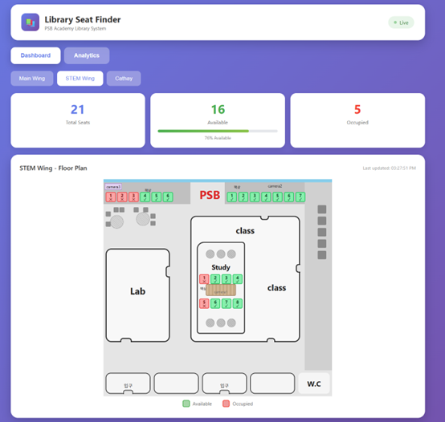
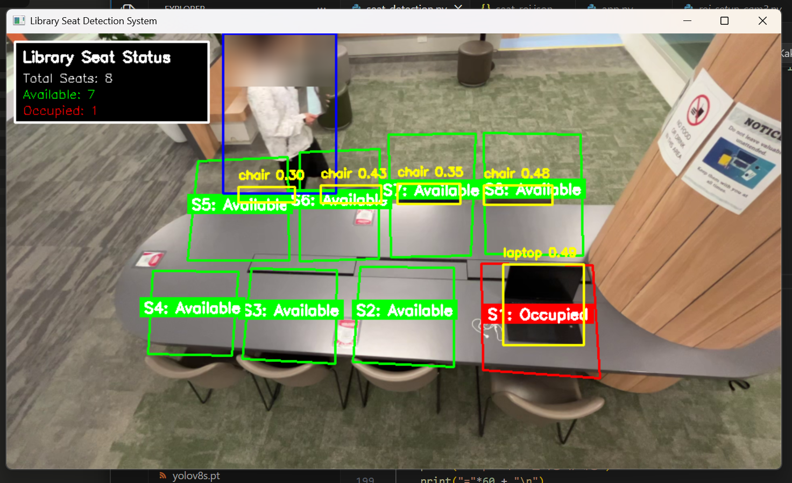
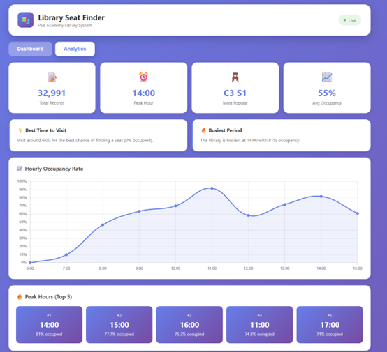
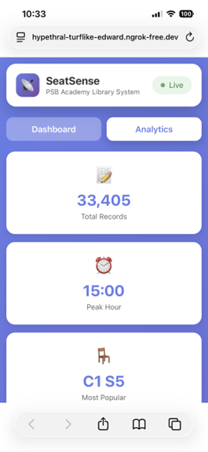

# SeatSense

> AI-powered library seat occupancy detection system using YOLO11 and computer vision

SeatSense is a real-time seat monitoring system that detects occupied and available seats across multiple library zones using deep learning. Built as a Final Year Project for BSc Computing Science (Coventry University via PSB Academy, Singapore).

##  Screenshots

### Dashboard


### Live Detection


### Analytics


### Mobile View


##  Key Features

- **Real-time Seat Detection** — Detects people, laptops, backpacks, and personal belongings using YOLO11 to determine seat occupancy
- **Multi-Camera Support** — Monitors 3 different camera zones simultaneously across multiple campuses
- **Privacy Protection** — Automatic face blurring on detected individuals
- **Live Video Streaming** — Real-time annotated video feed via Flask MJPEG
- **Analytics Dashboard** — Hourly trends, peak hours, seat popularity, and daily summaries
- **Smart Hold Logic** — Per-seat detection hold frames to prevent flickering
- **Mobile Responsive** — Optimized UI for both desktop and mobile devices

##  Tech Stack

| Category | Technologies |
|----------|--------------|
| **Backend** | Python, Flask |
| **AI / Computer Vision** | YOLO11 (Ultralytics), OpenCV |
| **Database** | SQLite |
| **Frontend** | HTML, CSS, JavaScript |
| **Deployment** | ngrok |

##  How It Works

1. **Cameras** capture video feeds from 3 different library zones
2. **YOLO11** detects people, laptops, backpacks, and other objects in each frame
3. **Seat Logic** determines occupancy by checking if detected objects fall within predefined seat regions (ROI)
4. **Flask Server** streams annotated video and serves the analytics dashboard
5. **SQLite** logs occupancy data for historical analysis

##  Main Files

- `app.py` — Main Flask application with API routes and streaming
- `database.py` — SQLite database operations and analytics queries
- `seat_detection.py` / `seat_detection_cam2.py` / `seat_detection_cam3.py` — Per-camera detection logic
- `roi_setup.py` — Tool for defining seat regions on each camera
- `generate_fake_data.py` — Sample data generator for testing
- `yolo11s.pt` — Pre-trained YOLO11 model weights

##  Getting Started

### Prerequisites
- Python 3.10+
- pip

### Installation

```bash
# Clone the repository
git clone https://github.com/ByungsukYoun/SeatSense.git
cd SeatSense

# Install dependencies
pip install flask ultralytics opencv-python numpy
```

### Running the Application

```bash
python app.py
```

Then open your browser:
- **Dashboard:** http://localhost:5000
- **Live Feed:** http://localhost:5000/live

## 🔧 Implementation Highlights

### Per-Seat Hold Logic
To handle detection flickering on seats with permanent objects (e.g., laptops occasionally missed by YOLO), each seat has its own configurable hold-frame counter that maintains "Occupied" status for N frames after the last detection.

### Privacy by Design
The system automatically blurs the upper third of each detected person's bounding box before streaming, ensuring user privacy in shared library spaces.

### Multi-threaded Architecture
Each camera runs two threads in parallel:
- **Frame Reader** captures frames at native FPS
- **Detection Loop** runs YOLO inference and updates seat status

This separation ensures smooth video streaming regardless of detection speed.

##  Detection Classes

The system detects the following object classes to determine seat occupancy:

| Class ID | Object | Used For |
|----------|--------|----------|
| 0 | Person | Active occupancy |
| 24 | Backpack | Belongings (seat held) |
| 56 | Chair | Reference |
| 63 | Laptop | Belongings (seat held) |
| 67 | Cell phone | Belongings (seat held) |

##  Academic Context

This project was developed as the Final Year Project for the **BSc Computing Science** programme at **Coventry University**, delivered via **PSB Academy, Singapore**.

##  Author

**Byungsuk Youn**
- GitHub: [@ByungsukYoun](https://github.com/ByungsukYoun)

##  License

This project was created for academic purposes.
